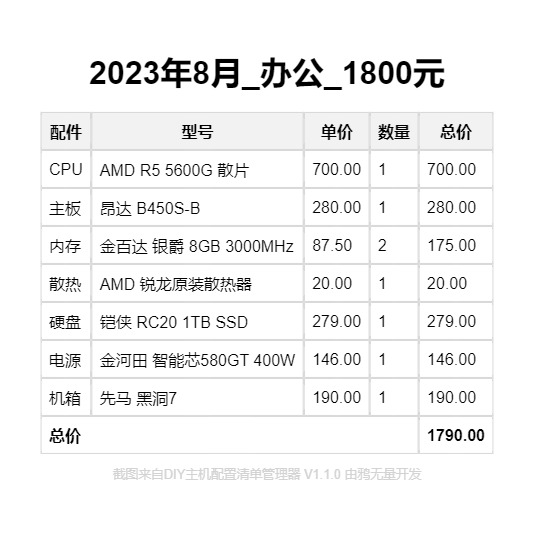
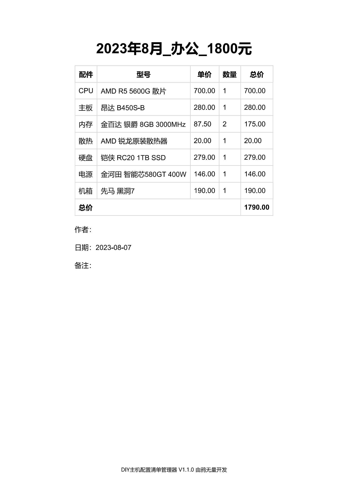

# DIY主机配置清单管理器（DIY PC Parts Lists Manager）

欢迎使用DIY主机配置清单管理器！该应用程序是一个基于Electron的项目，用于管理DIY主机配置清单。你可以在本地创建、保存和管理多个配置清单，并且还提供了打印和截图共享功能。  

Welcome to the DIY PC Parts Lists Manager! This application is an Electron-based project designed to manage DIY PC parts lists. You can create, save, and manage multiple parts lists locally, and it also offers printing and screenshot sharing functionalities.  

DIY PCパーツリストマネージャーへようこそ！このアプリケーションはElectronをベースとしたプロジェクトで、DIY PCパーツリストの管理を行います。ローカルで複数のパーツリストを作成、保存、管理することができ、また印刷やスクリーンショット共有の機能も提供しています。  

已更新至[V1.1.0](#v110)  


## 一、界面


## 二、功能
- 显示已有的配置清单
- 加载指定的配置清单
- 删除指定的配置清单
- 创建新的配置清单
- 计算单个配件的总价格
- 计算所有配件的总价格
- 添加或者删除一行配件
- 调整配件的排列顺序
- 保存新的配置清单
- 批量导入配置清单
- 从单个JSON文件导入新的配置清单
- 备份（导出）所有配置清单
- 查看所有配置清单
- 删除所有配置清单
- 打印配置清单
- 创建配置清单的截图
- 将配置清单导出CSV格式文件
- 复制配置清单的JSON数据

## 三、如何安装？
你可以选择在[Releases](https://github.com/Karasukaigan/pc-parts-lists-manager/releases)里直接下载打包好的程序，打开即用，无需安装Node.js和其他依赖。  

如果你有一定Node.js基础，或者想修改一些代码，可以选择从源代码运行。  

### 获取代码

- 从GitHub克隆项目：
  ```
  git clone https://github.com/Karasukaigan/pc-parts-lists-manager.git
  ```  

- 直接下载项目：
  从[GitHub页面](https://github.com/your-username/pc-parts-lists-manager)点击右上角“Code”按钮，再点击“Download ZIP”下载项目的ZIP压缩包，然后解压到本地目录。  

请确保你已经安装了**Node.js**。如果没有安装，你可以在[Node.js官网](https://nodejs.org/)下载并安装最新版本。

### 安装依赖

进入项目目录后，使用以下命令安装项目的依赖：
```
npm install
```  

### 运行应用

在安装完所有依赖后，你可以使用以下命令来运行DIY主机配置清单管理器：  
```
npm start
```  
这将启动Electron应用程序，并打开主机配置清单管理器界面。  

### 打包应用

如果你想将DIY主机配置清单管理器打包成可执行文件（exe），以便在其他计算机上使用，可以使用以下命令：
```
npm run package
```  
该命令将在项目的`dist/`目录下生成可执行文件。

## 四、分享你的配置清单

### 截图分享

点击“加载”按钮加载配置清单之后，点击“截图分享”按钮即可将截图保存至本地。  

  

### 打印配置清单

点击“加载”按钮加载配置清单之后，点击“打印”按钮即可选择打印机打印配置清单，或者保存为PDF。  

你可以在菜单栏的设置里点击“info.js”打开配置文件。修改`defaultAuthor`或者`defaultNote`来改变打印时默认显示的作者和备注信息。  

  

## 五、版本更新

### V1.1.0<span id="v110"></span>

1. 将“创建配置清单”按钮更名为“新建配置清单”
2. 修复了截图时出现的元素错位
3. 修复了新建配置清单页面的按钮样式错误
4. 在新建配置清单页面为每一行配件添加了上移、下移按钮，实现了配件的手动排序
5. 在新建配置清单页面，如果仅剩最后一行配件，删除按钮将无效
6. 调整了新建配置清单页面的样式
7. 新建配置清单页面中配置清单的JSON数据默认设置为隐藏
8. 在新建配置清单页面添加了显示/隐藏JSON按钮
9. 将新建配置清单时自定义的配置清单名称长度限制提升至50个字符（但依然不建议使用过长的名称）
10. 在菜单栏添加了设置菜单，便于直接打开main.js和info.js进行修改