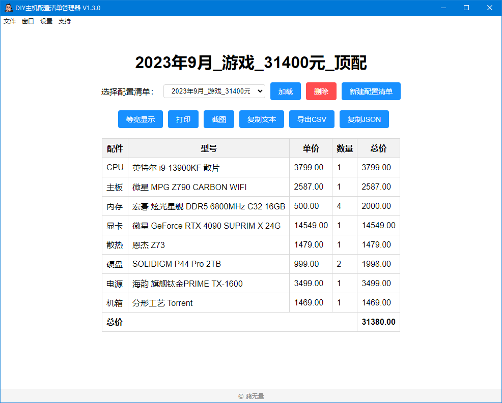
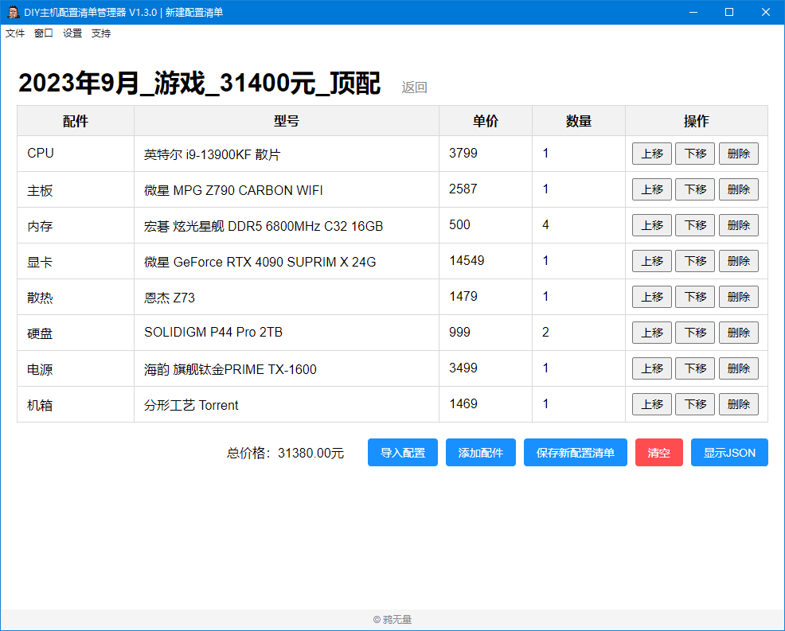

# DIY PC Parts Lists Manager
[中文](README_CH.md) | [日本語](README_JP.md)  

Welcome to the DIY PC Parts List Manager! This application is an Electron-based project designed to manage DIY PC parts lists. You can create, save, and manage multiple parts lists locally, and it also offers printing and screenshot sharing functionalities.


## User Interface




## Features
- Display existing parts lists
- Load a specific parts list
- Delete a specific parts list
- Create a new parts list
- Calculate the total price of individual parts
- Calculate the total price of all parts
- Add or remove a row for a part
- Save a new parts list
- Bulk import parts lists
- Import a new parts list from a single JSON file
- Backup (export) all parts lists
- View all parts lists
- Delete all parts lists
- Print a parts list
- Create a screenshot of a parts list
- Export a parts list to a CSV format file
- Copy the JSON data of a parts list

## How to Install?
You can choose to download the pre-packaged program directly from [Releases](https://github.com/Karasukaigan/pc-parts-lists-manager/releases). It can be run without installing Node.js and other dependencies.

If you have some Node.js knowledge or want to modify some code, you can choose to run the application from the source code.

### Get the Code

- Clone the project from GitHub:
  ```
  git clone https://github.com/Karasukaigan/pc-parts-lists-manager.git
  ```

- Directly download the project:
  Click the "Code" button in the upper right corner of the [GitHub page](https://github.com/your-username/pc-parts-lists-manager), then click "Download ZIP" to download the ZIP compressed package. After that, unzip it to a local directory.

Ensure that you have installed **Node.js**. If not, you can download and install the latest version from the [Node.js website](https://nodejs.org/).

### Install Dependencies

After entering the project directory, use the following command to install the project's dependencies:
```
npm install
```

### Run the Application

After installing all dependencies, you can use the following command to run the DIY PC Parts List Manager:
```
npm start
```
This will start the Electron application and open the PC Parts List Manager interface.

### Package the Application

If you want to package the DIY PC Parts List Manager into an executable file (exe) for use on other computers, use the following command:
```
npm run package
```
This command will generate an executable file in the `dist/` directory.